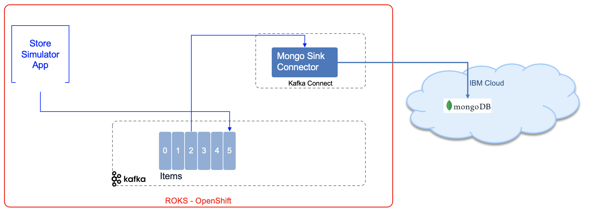
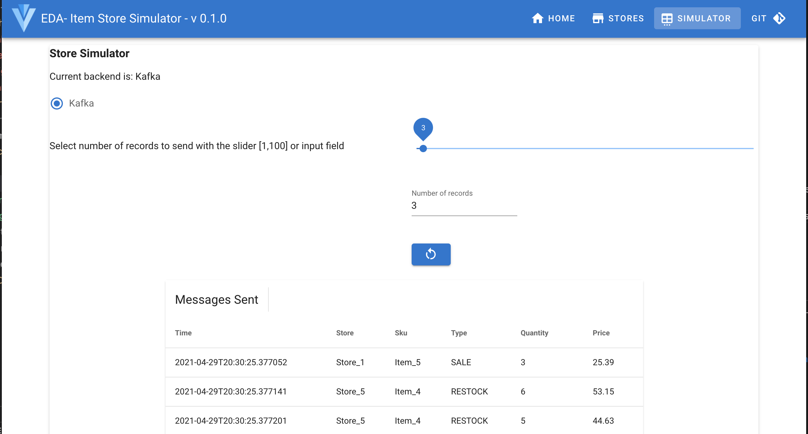
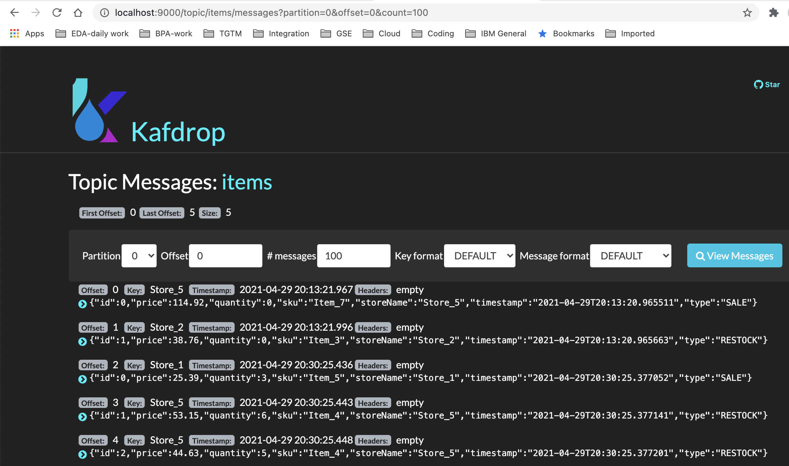

# Kafka connect with MongoDB Labs

In these labs, we are doing to get items posted from a simulator of items sold in stores on `items` Kafka topic to Mongodb `items` collection.

## Audience

Developers and architects who want to learn how to use Kafka Connect with a mongodb as Sink

## What you will learn

* [Lab1](): is running locally a Kafka broker 2.7 (Strimzi image), zookeeper, Mongodb and Kafka Connect. A simulator app helps to send messages to Kafka. This solution use [Apache Camel Kafka connector](https://camel.apache.org/camel-kafka-connector/latest/). 
* Lab2: 

The following figure illustrates the components involved:



## Lab 1: Run locally with docker

### Pre-requisites

You will need the following:

* [git](https://git-scm.com/)
* [docker-compose](https://docs.docker.com/compose/install/)

### Prepare the MongoDB Sink Connector

[Apache Camel Kafka connector](https://camel.apache.org/camel-kafka-connector/latest/) helps to get all the Camel Kafka connectors with source or sink connector.

* Clone the https://github.com/apache/camel-kafka-connector project and build it. 

```sh
git clone https://github.com/apache/camel-kafka-connector
cd camel-kafka-connector
# build mongodb connector
mvn package -DskipTests -Dhttp.ssl.insecure=true -Dhttp.ssl.allowall=true
```

This build should create a zip file under the `camel-kafka-connector/connectors/camel-mongodb-kafka-connector/target` named: `camel-mongodb-kafka-connector-0.10.0-SNAPSHOT-package.tar.gz`

**Attention** When trying to build all connectors, I had a lot of errors like the following: 

```sh
Could not resolve dependencies for project org.apache.camel.kafkaconnector:camel-consul-kafka-connector:jar:0.10.0-SNAPSHOT: Could not transfer artifact org.apache.camel:camel-health:jar:3.10.0-20210427.184531-134 from/to apache.snapshots (https://repository.apache.org/snapshots/): transfer failed for https://repository.apache.org/snapshots/org/apache/camel/camel-health/3.10.0-SNAPSHOT/camel-health-3.10.0-20210427.184531-134.jar: peer not authenticated
```

This may be due to network communication issue. In this case, look at the component that was not built and continue from there by adding `-rf :<component-name` for example build from `consul` component:

```sh
mvn package -DskipTests  -Dhttp.ssl.insecure=true -Dhttp.ssl.allowall=true -rf :camel-consul-kafka-connector
```

* Build the docker image for the Kafka connector with Strimzi Kafka as base image and the jars from Camel.

```sh
# under the config folder
docker build -t quay.io/ibmcase/camel-mongo-kconnector .
```

### Run locally with docker compose

1. Start Kafka, Zookeeper, KafDrop, Store Simulator and Mongodb

   ```sh
   docker-compose up -d
   ```

1. Create the needed `items` topic: `./scripts/createTopics.sh`

1. Verify environment

    * [simulator on 8080](http://localhost:8080/#/simulator) should have a page with Kafka backend and ready to send n records
    * [Kafdrop](http://localhost:9000/) to see the Kafka broker and `items` topic content
    * [Kafka connector cluster](http://localhost:8083/connectors) should return an empty array

1. Configure MongoDB sink connector by uploading the json config to the Kafka connector. This is done with one script that use curl POST to push the [camel-mongo-sink.json]()

   ```sh
   ./scripts/pushConnector.sh
   ```

   Verifying at the address [http://localhost:8083/connectors/camel-mongodb-kafka-connector/config](http://localhost:8083/connectors/camel-mongodb-kafka-connector) that the connector is created and started

1. Use the simulator to send n records by navigating to the simulator URL: [http://localhost:8080/#/simulator](http://localhost:8080/#/simulator) and then select Kafka and send 3 records

   

1. Verify records are in the `items` topic using Kafdrop: [http://localhost:9000/topic/items/messages?partition=0&offset=0&count=100](http://localhost:9000/topic/items/messages?partition=0&offset=0&count=100)

   

1. [Optional] you can look at the connector trace: 

   ```sh
   docker logs kconnect
   ```

1. Then verify in MongoDB the items collection:

    * Connect to `docker exec -ti mongo bash` then in the shell

        ```sh
        mongo --username root --password example
        use itemdb
        db.items.find())

        ```
1. To stop the environment once you are complete:

    ```sh
    docker-compose down
    ```

## Lab 2: Using Mongodb connector on OpenShift

### Prerequisite

### Prepare the MongoDB Sink Connector


## Related information

* [Kafka Connect Cluster API documentation](https://docs.confluent.io/platform/current/connect/references/restapi.html#kconnect-cluster).
* [EDA MQ to Kafka Lab](https://github.com/ibm-cloud-architecture/eda-lab-mq-to-kafka)